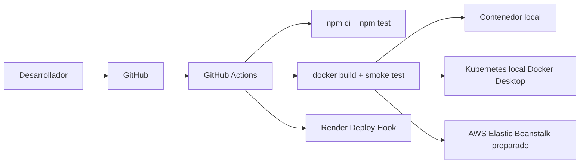

# Adaptacion Docker, Kubernetes y AWS

## Objetivo academico

Adaptar MediTurno para demostrar control de versiones con Git y GitHub, integracion continua con GitHub Actions, contenerizacion con Docker, orquestacion local con Kubernetes en Docker Desktop y preparacion de despliegue en AWS Elastic Beanstalk.

## Estado original

MediTurno es una aplicacion web academica con backend Node.js 20 y Express en `src/backend`, frontend HTML, CSS y JavaScript en `src/frontend`, pruebas Jest y Supertest en `src/backend/test`, CI/CD en `.github/workflows/ci.yml` y despliegue actual en Render mediante `render.yaml`.

El backend usa `PORT` o `5000`, exige `JWT_SECRET` y sirve el frontend desde `src/backend/public` cuando existe. En desarrollo local, si no existe `public/index.html`, usa `src/frontend`.

## Arquitectura anterior

El flujo original era:

1. El desarrollador sube cambios a GitHub.
2. GitHub Actions ejecuta pruebas del backend y valida archivos del frontend.
3. En `push` a `main`, GitHub Actions dispara el Deploy Hook de Render.
4. Render instala dependencias, ejecuta pruebas, copia el frontend a `src/backend/public`, poda dependencias de desarrollo e inicia `npm start`.

## Nueva arquitectura

La adaptacion agrega:

- GitHub como repositorio central.
- GitHub Actions para validar Node.js y Docker.
- Docker para empaquetar backend, frontend y dependencias de produccion.
- Kubernetes local en Docker Desktop para demostrar Deployment, Service, Secret y probes.
- AWS Elastic Beanstalk como alternativa preparada para despliegue con Docker.



## Flujo de cambio a despliegue

1. Crear una rama `feature/*`.
2. Implementar cambios.
3. Ejecutar pruebas locales.
4. Abrir Pull Request hacia `develop` o `main`.
5. GitHub Actions ejecuta el job `validate`.
6. GitHub Actions ejecuta el job `docker`.
7. Solo en `push` a `main`, el job de Render se ejecuta bajo las condiciones existentes.

## Dockerfile multi-stage

El `Dockerfile` usa Node.js 20 sobre Debian slim. Primero copia `package.json` y `package-lock.json` para aprovechar cache, ejecuta `npm ci`, copia el backend, copia `src/frontend` a `public`, define un `JWT_SECRET` temporal solo para las pruebas de build, ejecuta `npm test` y luego `npm prune --omit=dev`.

La imagen final copia solo el resultado necesario, configura `NODE_ENV=production`, `PORT=5000`, expone el puerto 5000, ejecuta con el usuario `node`, agrega un `HEALTHCHECK` contra `/api/health` e inicia con `npm start`.

## Imagen y contenedor

Una imagen Docker es el paquete inmutable con codigo, dependencias y comando de arranque. Un contenedor es una ejecucion concreta de esa imagen. La imagen puede construirse una vez y ejecutarse muchas veces con variables de entorno distintas.

## Kubernetes local

Un Pod ejecuta el contenedor de MediTurno. Un Deployment mantiene el Pod disponible y permite actualizaciones controladas. Un Service expone el Pod dentro del cluster. Un Secret entrega `JWT_SECRET` sin escribirlo en los manifiestos versionados.

La configuracion usa una sola replica porque usuarios y turnos se guardan actualmente en memoria.

## Readiness y liveness probes

La readiness probe indica si el Pod esta listo para recibir trafico. La liveness probe indica si el contenedor debe reiniciarse. Ambas usan `GET /api/health`.

## Elastic Beanstalk

Elastic Beanstalk permite desplegar aplicaciones web sin administrar manualmente toda la infraestructura. En esta adaptacion se prepara para Docker sobre Amazon Linux 2023, en modo Single instance para reducir complejidad academica. No se usa EKS.

## Docker vs Kubernetes

Docker construye y ejecuta contenedores. Kubernetes orquesta contenedores: crea Pods, reinicia cargas fallidas, expone Services y gestiona configuracion declarativa.

## CI vs CD

CI valida automaticamente cambios con instalacion, pruebas y construccion. CD despliega automaticamente cuando se cumplen condiciones definidas. En este proyecto Render conserva el despliegue automatico solo para `push` a `main`.

## Comandos de prueba

```bash
cd src/backend
npm ci
npm test
cd ../..
docker build -t mediturno-app:local .
docker run --name mediturno-local -d -p 5000:5000 -e JWT_SECRET="valor-local-de-prueba" mediturno-app:local
curl http://localhost:5000/api/health
curl http://localhost:5000/
docker rm -f mediturno-local
kubectl apply -k k8s --dry-run=client
```

## Resultados esperados

- `npm test` debe pasar.
- `docker build` debe terminar correctamente.
- `/api/health` debe devolver HTTP 200.
- `/` debe devolver HTML.
- Los manifiestos Kubernetes deben ser validos.
- El workflow debe conservar Render y agregar validacion Docker.

## Limitaciones actuales

- Usuarios y turnos se almacenan en memoria.
- Se usa una sola replica.
- Los datos se pierden al reiniciar el proceso o el contenedor.

## Posibles mejoras

- Agregar base de datos persistente.
- Publicar imagen en Amazon ECR.
- Configurar HTTPS.
- Agregar monitoreo.
- Escanear imagen Docker.

## Evidencias para el informe

- Rama de trabajo.
- Salida de `npm test`.
- Salida de `docker build`.
- `docker ps` con el contenedor iniciado.
- Respuesta de `/api/health`.
- Pantalla de la pagina principal.
- Manifiestos Kubernetes.
- Dry-run o ejecucion real en Docker Desktop.
- Workflow con job `docker`.
- Guia de Elastic Beanstalk.

## Dificultades y soluciones

- `JWT_SECRET` no puede versionarse: se inyecta como variable de entorno, Secret de Kubernetes o propiedad protegida de Elastic Beanstalk.
- El frontend debe estar en `src/backend/public` para produccion: el Dockerfile copia `src/frontend` a `public`.
- Varias replicas no comparten memoria: se usa una sola replica hasta agregar base de datos.
- Kubernetes puede no estar habilitado: se deja preparado y se valida con dry-run si `kubectl` esta disponible.

## Limpieza local y AWS

Local:

```bash
docker rm -f mediturno-local
kubectl delete -k k8s
kubectl delete secret mediturno-secret
```

AWS:

1. Terminar el entorno Elastic Beanstalk.
2. Revisar EC2, S3, CloudFormation y grupos de seguridad.
3. Eliminar recursos asociados que no se necesiten.
4. Confirmar que no queden recursos facturables activos.
